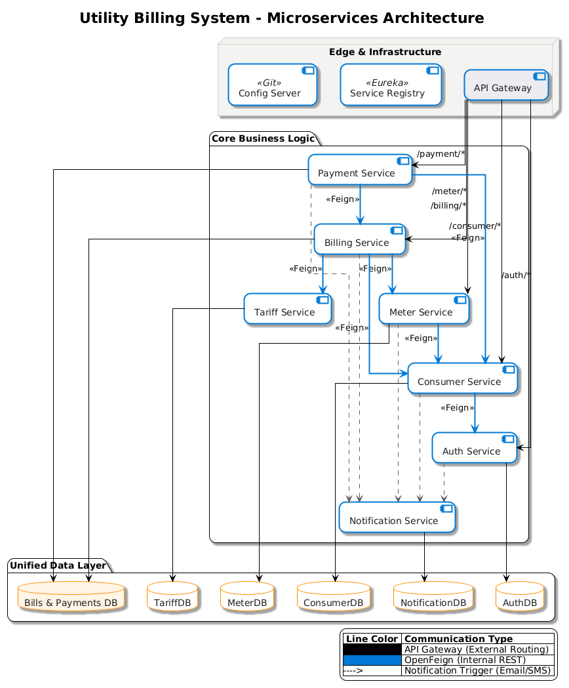

# Utility Billing System

A **secure, scalable, microservices-based Utility Billing System** designed to manage consumer accounts, utility connections, meter readings, billing cycles, payments, and reporting through a centralized platform.

This project demonstrates **enterprise-grade backend design**, **role-based security**, **clean architecture**, and **CI/CD readiness**, closely resembling real-world utility and financial systems.

---

## 1. Business Overview

Utility service providers (Electricity, Water, Gas, etc.) handle large volumes of consumers, recurring billing cycles, and financial transactions. Traditional or semi-manual systems often result in:

- Billing inaccuracies due to incorrect meter readings  
- Delayed bill generation and payment tracking  
- Poor visibility into outstanding dues and revenue  
- Limited analytics for operational and leadership decisions  

This system addresses these challenges by providing an **automated, centralized, and secure billing platform**.

---

## 2. Project Objectives

- Build a full-stack enterprise application using **Spring Boot** and **Angular**
- Implement **JWT-based authentication** and **role-based authorization**
- Automate meter-based billing using configurable **tariff slabs**
- Support both **online and offline payments**
- Provide dashboards and reports for operational visibility
- Follow **clean architecture**, **microservices principles**, and industry best practices

---

## 3. High-Level Features

- Consumer onboarding and profile management  
- Utility connection requests and meter assignment  
- Monthly meter reading management  
- Automated bill generation with slab-based tariff calculation  
- Payment processing and invoice generation  
- Notifications for bills, payments, and approvals  
- Secure role-based access control  
- CI/CD pipeline with enforced quality gates  

---

## 4. User Roles

| Role | Responsibilities |
|-----|------------------|
| **Admin** | User management, tariff setup, approvals |
| **Billing Officer** | Meter readings, bill generation |
| **Accounts Officer** | Payment recording, reconciliation |
| **Consumer** | View bills, make payments, track history |

---

## 5. Architecture Overview

The system follows a **Microservices Architecture** with **REST-based communication**.

### System Architecture Diagram

### Core Components

- **API Gateway** – Single entry point, JWT validation, request routing  
- **Service Registry (Eureka)** – Dynamic service discovery  
- **Config Server** – Centralized configuration management  
- **Auth Service** – Authentication, authorization, JWT management  
- **Consumer Service** – Consumer onboarding and profile management  
- **Meter Service** – Utility connections and meter readings  
- **Tariff Service** – Tariff slabs, taxes, and penalties  
- **Billing Service** – Bill computation and lifecycle management  
- **Payment Service** – Online/offline payments and invoice generation  
- **Notification Service** – Email and OTP notifications  

Each microservice owns **its own database**, ensuring **loose coupling**, **data isolation**, and **independent scalability**.

---

## 6. Technology Stack

### Backend
- Java 17  
- Spring Boot  
- Spring Web  
- Spring Data MongoDB  
- Spring Security (JWT)  
- OpenFeign  
- Resilience4j  

### Frontend
- Angular  
- TypeScript  
- Angular Material / Bootstrap  

### Database
- MongoDB (one database per microservice)

### DevOps & Tooling
- Docker & Docker Compose  
- Jenkins  
- SonarQube  
- Postman  

### Testing
- JUnit 5  
- Mockito  
- Spring Boot Test  

---

## 7. CI/CD Pipeline

The project follows a **quality-first CI/CD pipeline**:

1. Git Commit  
2. Jenkins Build  
3. Unit Tests Execution  
4. SonarQube Code Scan  
5. Quality Gate Validation  
6. Docker Image Build  
7. Docker Compose Deployment  

Builds fail automatically if quality standards are not met.

---

## 8. Conclusion

This Utility Billing System is designed as a **production-ready enterprise application**, showcasing:

- Scalable microservices architecture  
- Secure role-based access control  
- Clean, maintainable codebase  
- Automated testing and CI/CD enforcement  

It serves as both a **real-world system blueprint** and a **strong demonstration of enterprise backend and DevOps expertise**.
